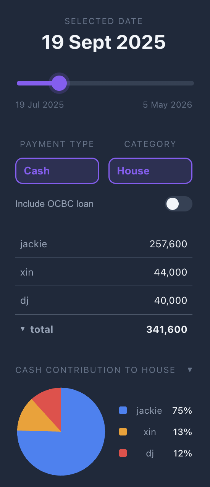

# google-sheets-finance-sidebar

A React + TypeScript sidebar for a personal Google Sheets workbook that tracks shared house/misc/interest payments across Jackie, Xin, DJ and an OCBC loan, split by cash vs CPF.

The app is bundled into a **single HTML file** by [vite-plugin-singlefile](https://github.com/richardtallent/vite-plugin-singlefile) and pasted into Apps Script as the sidebar's HTML service template, where it talks back to the spreadsheet via `google.script.run`.



## What it shows

Pick a date on the slider (range is hard-coded in [src/App.tsx:4-5](src/App.tsx#L4-L5)) and the sidebar shows the cumulative snapshot at that point in time:

- **Payment Type** — cash, cpf, or total
- **Category** — house, misc, interest, or total
- **Include OCBC loan** toggle — folds the OCBC loan row into the table and contribution chart
- **Breakdown table** — per-entity values, collapsible under the total row
- **Pie charts** — contribution share, cash vs CPF for the selected category, and per-person cash vs CPF (each collapsible)

## Data flow

1. The Apps Script backend exposes `getChartData()`, which returns a `SheetData` object with parallel arrays keyed by date — one array per `{entity}{paymentType}{category}` combination (see the type at [src/App.tsx:45-61](src/App.tsx#L45-L61)).
2. On mount, [App.tsx](src/App.tsx) calls `google.script.run.getChartData()` and stores the result.
3. The slider value maps to a date; the component finds the latest row at or before that date with `findLastIndex` and sums the relevant fields based on the current category / payment type / OCBC toggle.

The Apps Script side (the `getChartData` function and the sheet schema it reads) lives in the bound Apps Script project, not in this repo.

## Develop

```bash
npm install
npm run dev
```

Local dev runs without a Google Sheets backend — `google.script.run` will be `undefined`, the fetch rejects, and the UI stays in its loading state. To exercise the rendered output during development, stub the runner or temporarily seed `data` with sample values.

## Build & deploy

```bash
npm run build
```

This runs `tsc -b && vite build && pbcopy < dist/index.html` — type-checks, bundles into a single inlined `dist/index.html`, and copies the result to the macOS clipboard. Paste it into the Apps Script project's HTML file (the one served by `HtmlService.createHtmlOutputFromFile(...).setTitle(...)` in the sidebar trigger), then reopen the sidebar in Sheets.
